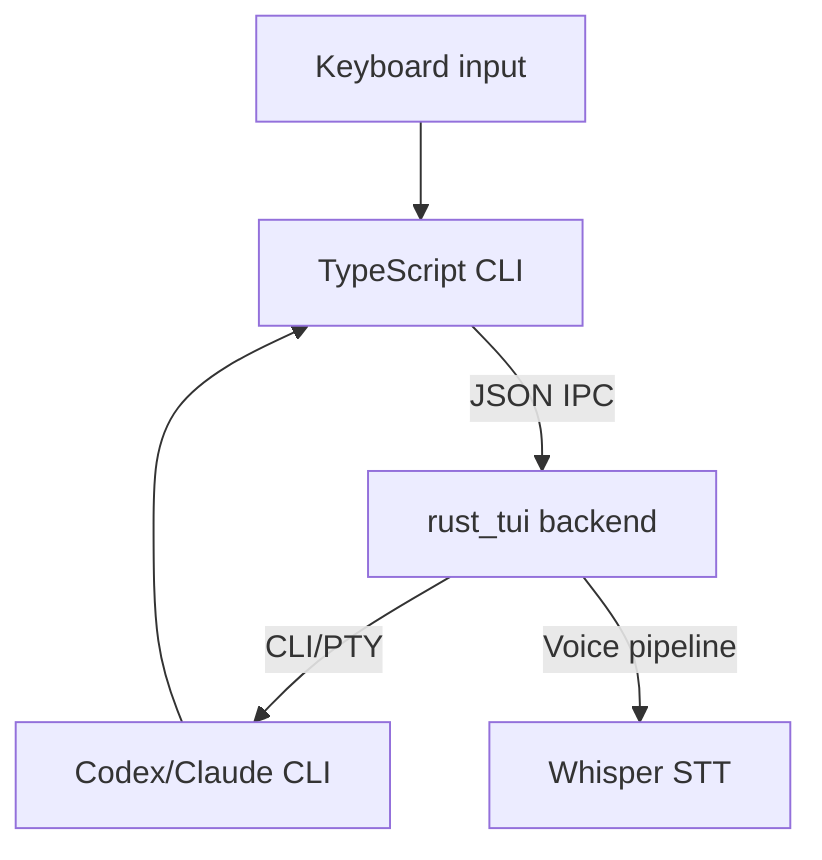

# Codex Voice Architecture

This repo has two user-facing modes:

1. **Overlay mode (default):** Rust-only. Runs Codex in a PTY and forwards raw ANSI output.
2. **Legacy TypeScript CLI:** Node frontend + Rust backend via JSON-IPC.

## Overlay Mode (Rust-only)

```mermaid
graph TD
  UserInput[Keyboard input] --> Overlay[codex_overlay (Rust)]
  Voice[Voice capture (cpal + VAD + Whisper)] --> Overlay
  Overlay -->|PTY| Codex[Codex CLI]
  Codex -->|ANSI output| Terminal[Your terminal]
  Overlay -->|Status line| Terminal
```

Key points:
- `codex_overlay` spawns Codex in a PTY and **does not** parse slash commands.
- Voice transcripts are injected as keystrokes into the PTY.
- A status line is rendered at the bottom without corrupting Codex output.

## Legacy TypeScript CLI (IPC)



Key points:
- The TS CLI handles `/voice`, `/auto`, `/provider`, etc.
- Rust handles audio + STT + provider execution, and streams tokens back over IPC.

## Main Components

- `rust_tui/src/bin/codex_overlay.rs`: Overlay entry point.
- `rust_tui/src/pty_session.rs`: PTY handling (raw passthrough for overlay).
- `rust_tui/src/voice.rs`: Voice pipeline orchestration.
- `rust_tui/src/ipc.rs`: JSON-IPC protocol (legacy mode).
- `ts_cli/src/index.ts`: Legacy CLI front end.

## Data Flow Summary

- **Overlay:** Keyboard + voice -> PTY -> Codex -> ANSI output -> Terminal
- **Legacy:** Keyboard -> TS -> Rust IPC -> Providers -> TS
